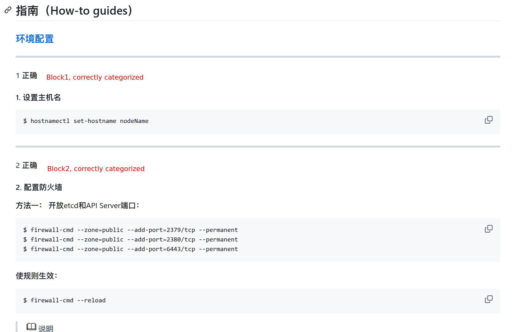
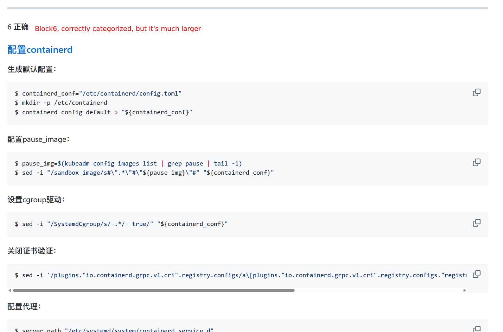
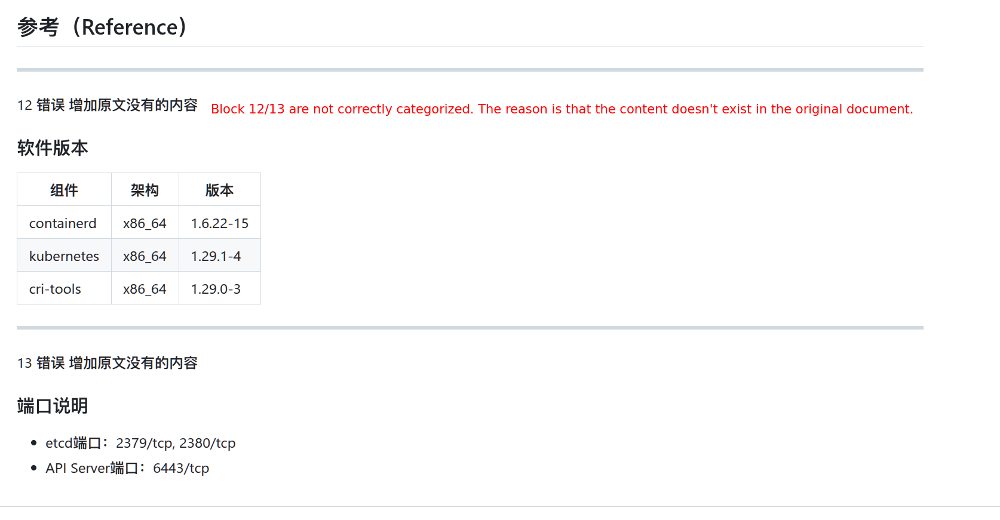

# [diataxis-doc-bot](https://github.com/oss-know/diataxis-doc-bot)机器人测试结果

从 [openEuler's docs](https://gitee.com/openeuler/docs.git)文档中随机选出23篇Markdown文件，使用diataxis文档机器人按照[diataxis文档理论](https://diataxis.fr/)对其进行重构，对文档内容划分为Tutorial，Explanation，Guide和Reference四类，分类结果如下表所示：

| 测试文档                                         | 分块数量 | 分类正确数量 | 分类不正确原因             |
| ------------------------------------------------------------ | ---------- | ----------- | ---------------------------- |
| docker_engine/refactor/image-management-1.md                 | 3          | 3           |                              |
| docker_engine/refactor/command-reference.md                  | 1          | 0           | 内容不完整      |
| docker_engine/refactor/statistics.md                         | 3          | 3           |                              |
| docker_engine/refactor/container-engine.md                   | 3          | 3           |                              |
| docker_engine/refactor/overview.md                           | 1          | 1           |                              |
| kubernetes/refactor/eggo-deploying-a-cluster.md              | 6          | 6           |                              |
| kubernetes/refactor/kubernetes-containerd.md                 | 13         | 10          | 添加或丢失内容 |
| kubernetes/refactor/deploying-a-Kubernetes-cluster-manually.md | 2          | 2           |                              |
| kubernetes/refactor/eggo-tool-introduction.md                | 8          | 8           |                              |
| kubernetes/refactor/deploying-control-plane-components.md    | 11         | 9           |                              |
| kubernetes/refactor/running-the-test-pod.md                  | 2          | 2           |                              |
| kubernetes/refactor/eggo-automatic-deployment.md             | 1          | 1           |                              |
| kubernetes/refactor/installing-etcd.md                       | 7          | 6           |                              |
| kubernetes/refactor/preparing-VMs.md                         | 6          | 6           |                              |
| kubernetes/refactor/preparing-certificates.md                | 10         | 10          |                              |
| kubernetes/refactor/deploying-a-node-component.md            | 17         | 13          |                              |
| kubernetes/refactor/eggo-dismantling-a-cluster.md            | 3          | 3           |                              |
| kubernetes/refactor/overview.md                              | 1          | 0           | 添加不相关的内容 |
| kubernetes/refactor/installing-the-Kubernetes-software-package.md | 2          | 2           |                              |
| isulad+k8s/refactor/gitlab-runner-deploy.md                  | 6          | 6           |                              |
| isulad+k8s/refactor/isulad+k8s-environment-deploy.md         | 11         | 2           | 内容不完整      |
| isulad+k8s/refactor/gitlab-deploy.md                         | 7          | 7           |                              |
| isulad+k8s/refactor/overview.md                              | 3          | 3           |                              |
| 总计                                                        | 127        | 106         | 正确率: 83.46% |

## 分类结果如何标注？

在所有重构的文档中，通过一行短横线来标注文档机器人划分的块（block），短横线次行为人工校验结果，结果包含编号、是否正确、错误原因。`calculate_correctness.py`脚本用于读取人工标注，统计并打印上表中的数据。

以下示意图展示了重构文档中，块是如何分类的：

### 较小的块，分类正确

注意上文中提到的“短线组成的行”可能被Markdown引擎渲染为一个单独的横线（最终渲染的风格可能会有所不同）。下例为一个较大的分块，且分类正确：

### 较大的块，分类正确

如果分类错误，会对其进行标注并尽量给出错误原因：

### 错误的分类

## 分类的结果可能是变化的！

请注意，大模型每次产生的结果都不尽相同，因此最终的正确率会有所变化，但是变化范围不会很大。