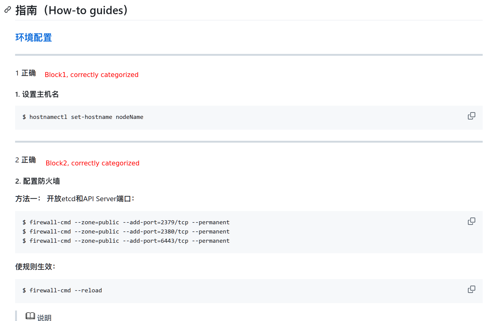
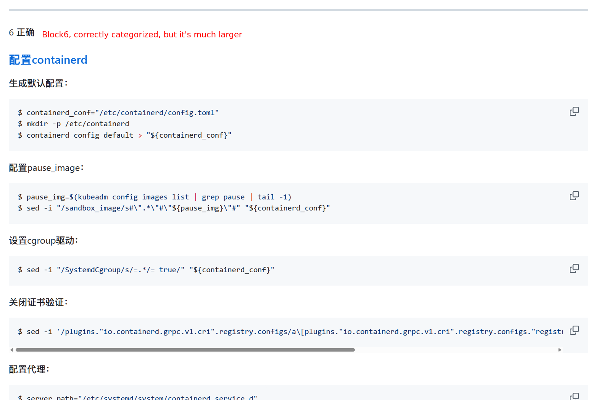

# Testing result of the [diataxis-doc-bot](https://github.com/oss-know/diataxis-doc-bot)

We tested the diataxis doc bot on the following 23 randomly selected markdown document files(from [openEuler's docs](https://gitee.com/openeuler/docs.git)), by the [diataxis](https://diataxis.fr/) document theory, the bot will read and split the document content into 4 categories: Tutorial, Explanation, Guide and reference, the classification result is shown in the table blow:

| Tested document file | Num blocks | Num correct | Incorrect reason |
| ---- | ---- | ---- | ---- |
| docker_engine/refactor/image-management-1.md|3|3||
| docker_engine/refactor/command-reference.md|1|0|Incomplete content|
| docker_engine/refactor/statistics.md|3|3||
| docker_engine/refactor/container-engine.md|3|3||
| docker_engine/refactor/overview.md|1|1||
| kubernetes/refactor/eggo-deploying-a-cluster.md|6|6||
| kubernetes/refactor/kubernetes-containerd.md|13|10|Adding / missing content|
| kubernetes/refactor/deploying-a-Kubernetes-cluster-manually.md|2|2||
| kubernetes/refactor/eggo-tool-introduction.md|8|8||
| kubernetes/refactor/deploying-control-plane-components.md|11|9||
| kubernetes/refactor/running-the-test-pod.md|2|2||
| kubernetes/refactor/eggo-automatic-deployment.md|1|1||
| kubernetes/refactor/installing-etcd.md|7|6||
| kubernetes/refactor/preparing-VMs.md|6|6||
| kubernetes/refactor/preparing-certificates.md|10|10||
| kubernetes/refactor/deploying-a-node-component.md|17|13||
| kubernetes/refactor/eggo-dismantling-a-cluster.md|3|3||
| kubernetes/refactor/overview.md|1|0|Adding content|
| kubernetes/refactor/installing-the-Kubernetes-software-package.md|2|2||
| isulad+k8s/refactor/gitlab-runner-deploy.md|6|6||
| isulad+k8s/refactor/isulad+k8s-environment-deploy.md|11|2|Incomplete content|
| isulad+k8s/refactor/gitlab-deploy.md|7|7||
| isulad+k8s/refactor/overview.md|3|3||
| Total |127|106|Ratio on correctness: 83.46%|

## How is the result labeled?

Within each refactored document, we mark the blocks by a single line of repeated dashes, following the "dash line" is the artificial check result on is the categorization of the block correct, if not correct, why it's wrong(tell the reason as much as possible). The python code `calculate_correctness.py` reads the checks and print the statistics of the above table.

This is how the categorizations are marked in the refactored document:

### Small block, correct category

Notice that the "dashed line" might be rendered by the markdown engine as a single line(the style might be different), this is a much larger block:

### Large block, correct category

If something goes wrong, we'll mark it and give the reason(as much as possible):

### Incorrect categorization

## Finally, the result might be different!

Notice that the LLM might produce different result as each time run, so the final correctness ratio might vary(but should within a small range).
