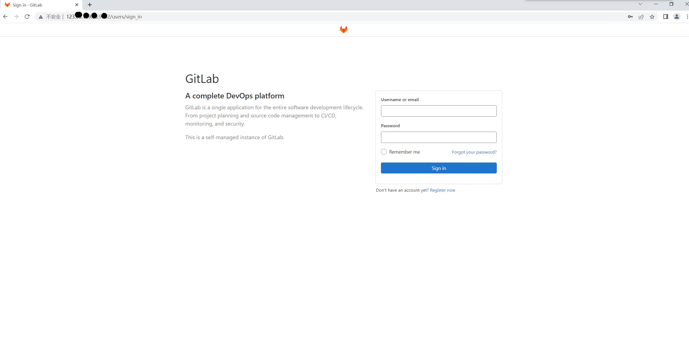
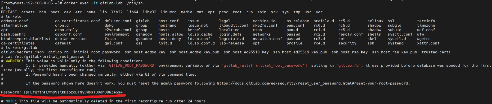

# gitlab部署

## 文档说明  

gitlab部署 是场景一（基于gitlab-ci从“0”开始构建欧拉原生开发CICD部署）所需步骤，场景二（欧拉原生开发执行机集群被gitlab-ci纳管）可跳过此步骤进入gitlab-runner部署。

## 准备服务器

需准备1台openEuler机器，建议在openEuler-22.03及以上版本运行。

## 启动gitlab

将需要的yaml文件拷贝至/home目录，并启动对应的pod。
> [!NOTE]说明
> gitlab相关的yaml文件可从官网获得。

以下为yaml文件的示例参考，请根据实际情况进行修改。   

gitlab-redis.yaml：

```bash
apiVersion: apps/v1
kind: Deployment
metadata:
  name: redis
  namespace: default
  labels:
    name: redis
spec:
  selector:
    matchLabels:
      name: redis
  template:
    metadata:
      name: redis
      labels:
        name: redis
    spec:
      containers:
      - name: redis
        image: 10.35.111.11:5000/redis:latest
        imagePullPolicy: IfNotPresent
        ports:
        - name: redis
          containerPort: 6379
        volumeMounts:
        - mountPath: /var/lib/redis
          name: data
        livenessProbe:
          exec:
            command:
            - redis-cli
            - ping
          initialDelaySeconds: 30
          timeoutSeconds: 5
        readinessProbe:
          exec:
            command:
            - redis-cli
            - ping
          initialDelaySeconds: 5
          timeoutSeconds: 1
      volumes:
      - name: data
        emptyDir: {}

---
apiVersion: v1
kind: Service
metadata:
  name: redis
  namespace: default
  labels:
    name: redis
spec:
  ports:
    - name: redis
      port: 6379
      targetPort: redis
  selector:
    name: redis

```

gitlab-postgresql.yaml： 

```bash
apiVersion: apps/v1
kind: Deployment
metadata:
  name: postgresql
  namespace: default
  labels:
    name: postgresql
spec:
  selector:
    matchLabels:
      name: postgresql
  template:
    metadata:
      name: postgresql
      labels:
        name: postgresql
    spec:
      containers:
      - name: postgresql
        image: 10.35.111.11:5000/postgres:13.6
        imagePullPolicy: IfNotPresent
        env:
        - name: POSTGRES_HOST_AUTH_METHOD
          value: trust
        - name: DB_USER
          value: gitlab
        - name: DB_PASS
          value: passw0rd
        - name: DB_NAME
          value: gitlab_production
        - name: DB_EXTENSION
          value: pg_trgm
        ports:
        - name: postgres
          containerPort: 5432
        volumeMounts:
        - mountPath: /var/lib/postgresql
          name: data
        livenessProbe:
          exec:
            command:
            - pg_isready
            - -h
            - localhost
            - -U
            - postgres
          initialDelaySeconds: 30
          timeoutSeconds: 5
        readinessProbe:
          exec:
            command:
            - pg_isready
            - -h
            - localhost
            - -U
            - postgres
          initialDelaySeconds: 5
          timeoutSeconds: 1
      volumes:
      - name: data
        emptyDir: {}

---
apiVersion: v1
kind: Service
metadata:
  name: postgresql
  namespace: default
  labels:
    name: postgresql
spec:
  ports:
    - name: postgres
      port: 5432
      targetPort: postgres
  selector:
    name: postgresql

```

gitlab.yaml：

```bash
apiVersion: apps/v1
kind: Deployment
metadata:
  name: gitlab
  namespace: default
  labels:
    name: gitlab
spec:
  selector:
    matchLabels:
      name: gitlab
  template:
    metadata:
      name: gitlab
      labels:
        name: gitlab
    spec:
      containers:
      - name: gitlab
        image: 10.35.111.11:5000/yrzr/gitlab-ce-arm64v8:14.3.2-ce.0
        imagePullPolicy: IfNotPresent
        env:
        - name: TZ
          value: Asia/Shanghai
        - name: GITLAB_TIMEZONE
          value: Beijing
        - name: GITLAB_SECRETS_DB_KEY_BASE
          value: long-and-random-alpha-numeric-string
        - name: GITLAB_SECRETS_SECRET_KEY_BASE
          value: long-and-random-alpha-numeric-string
        - name: GITLAB_SECRETS_OTP_KEY_BASE
          value: long-and-random-alpha-numeric-string
        - name: GITLAB_ROOT_PASSWORD
          value: admin321
        - name: GITLAB_ROOT_EMAIL
          value: 517554016@qq.com
        - name: GITLAB_HOST
          value: git.qikqiak.com
        - name: GITLAB_PORT
          value: "80"
        - name: GITLAB_SSH_PORT
          value: "22"
        - name: GITLAB_NOTIFY_ON_BROKEN_BUILDS
          value: "true"
        - name: GITLAB_NOTIFY_PUSHER
          value: "false"
        - name: GITLAB_BACKUP_SCHEDULE
          value: daily
        - name: GITLAB_BACKUP_TIME
          value: 01:00
        - name: DB_TYPE
          value: postgres
        - name: DB_HOST
          value: postgresql
        - name: DB_PORT
          value: "5432"
        - name: DB_USER
          value: gitlab
        - name: DB_PASS
          value: passw0rd
        - name: DB_NAME
          value: gitlab_production
        - name: REDIS_HOST
          value: redis
        - name: REDIS_PORT
          value: "6379"
        ports:
        - name: http
          containerPort: 80
        - name: ssh
          containerPort: 22
        volumeMounts:
        - mountPath: /home/git/data
          name: data
        livenessProbe:
          httpGet:
            path: /
            port: 80
          initialDelaySeconds: 180
          timeoutSeconds: 5
        readinessProbe:
          httpGet:
            path: /
            port: 80
          initialDelaySeconds: 5
          timeoutSeconds: 1
      volumes:
      - name: data
        emptyDir: {}

---
apiVersion: v1
kind: Service
metadata:
  name: gitlab
  namespace: default
  labels:
    name: gitlab
spec:
  ports:
    - name: http
      port: 80
      targetPort: http
      nodePort: 30852
    - name: ssh
      port: 22
      nodePort: 32353
      targetPort: ssh
  selector:
    name: gitlab
  type: NodePort
```

启动相应的容器：

```bash
# kubectl apply -f gitlab-redis.yaml
# kubectl apply -f gitlab-postgresql.yaml
# kubectl apply -f gitlab.yaml
```

可通过命令查看gitlab pod是否搭建完成：

```bash
# kubectl get pod -A -owide
```

## 登录gitlab

查看是否可以登录gitlab网页，网址为ip地址加设定的端口。


用户名为root，默认密码需进入容器后查看密码文件。

```bash
# kubectl exec -it gitlab-lab -n default /bin/sh
# cat /etc/gitlab/initial_root_password
```



- 登录后界面如图：


