# gitlab runner部署及测试

## 镜像/软件信息

安装过程中需要用到的镜像名称如下表，版本号为示例安装时用到的版本，仅供参考。

| 镜像                                | 版本     |
|------------------------------------|----------|
| gitlab/gitlab-runner               | alpine-v14.4.0  |
| gitlab/gitlab-runner-helper        | x86_64-54944146  |

如果在无外网环境中搭建，可以从下方链接提前下载对应的镜像。镜像下载地址：dockerhub官网 <https://hub.docker.com>  

## 使用gitlab-runner.yaml启动runner容器

配置gitlab-runner.yaml文件，修改文件中的镜像名，以下为yaml文件的示例参考，请根据实际搭建进行修改。

```bash
vim gitlab-runner.yaml
```

```conf
apiVersion: apps/v1
kind: Deployment
metadata:
  name: gitlab-runner
  namespace: default
spec:
  replicas: 1
  selector:
    matchLabels:
      name: gitlab-runner
  template:
    metadata:
      labels:
        name: gitlab-runner
    spec:
      containers:
      - args:
        - run
        image: gitlab/gitlab-runner:alpine-v14.4.0
        imagePullPolicy: IfNotPresent
        name: gitlab-runner
        volumeMounts:
        - mountPath: /etc/gitlab-runner
          name: config
          readOnly: false
        - mountPath: /etc/ssl/certs
          name: cacerts
          readOnly: true
      restartPolicy: Always
      volumes:
      - hostPath:
          path: /etc/gitlab-runner
        name: config
      - hostPath:
          path: /etc/ssl/key
        name: cacerts

```

启动容器：

```bash
# kubectl apply -f gitlab-runner.yaml
# kubectl get pod -A -o wide
```

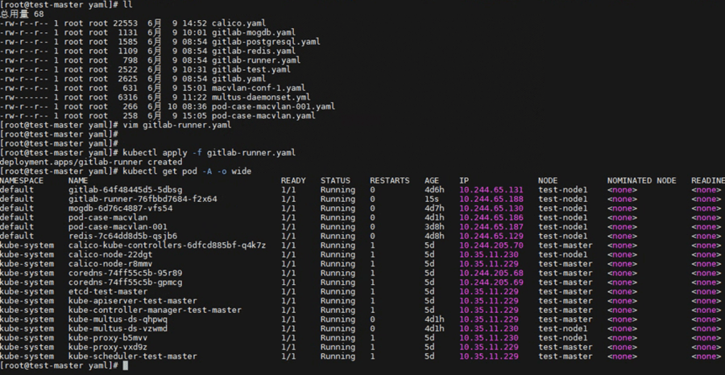

## 登录gitlab容器网页-用户证书认证

1. 新建项目。

   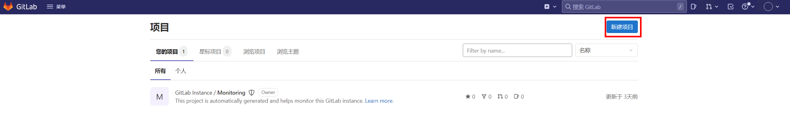

2. 创建空白项目。

   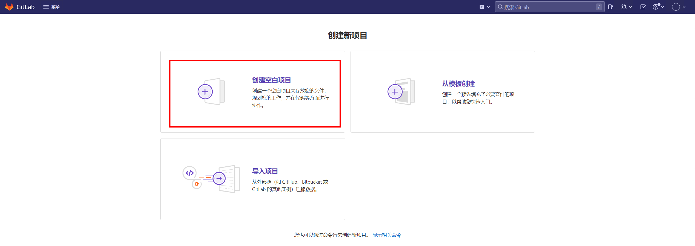

3. 自定义项目名称。

   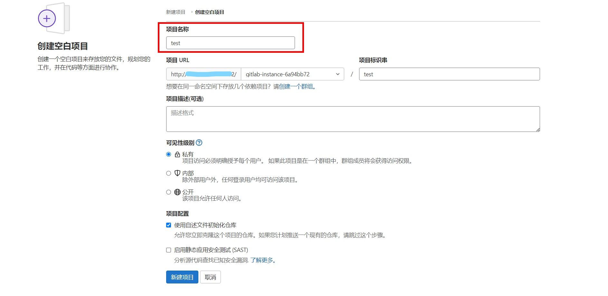

4. 设置--CI/CD--Runner--展开。

   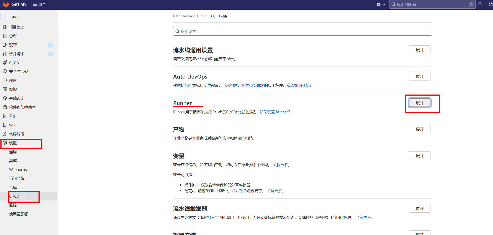

5. 记录注册Runner的地址和令牌。

   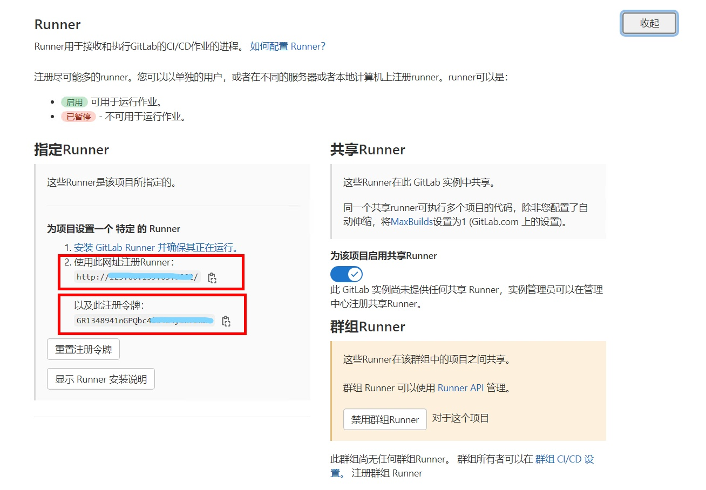

6. 导入证书文件。

   在master节点上查看并生成证书文件，共三个文件admin.crt、admin.key、ca.crt。

   - 查看证书信息

     ```bash
     # cat /etc/kubernetes/admin.conf
     ```

     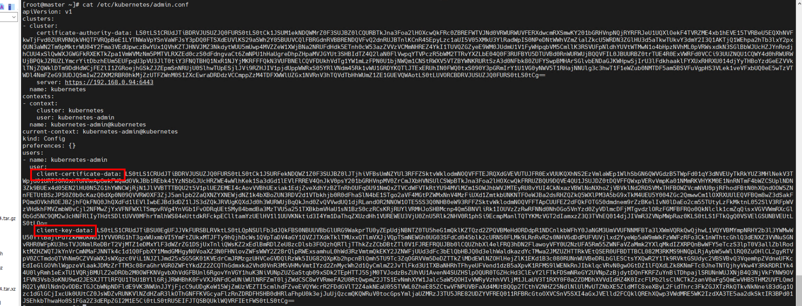

   - 加密生成admin.crt

     ```bash
     # echo “${client-certificate-data}” | base64 -d > admin.crt
     ```

   - 加密生成admin.key

     ```bash
     # echo “${client-key-data}” | base64 -d > admin.key
     ```

   - 在manager节点上获取ca的证书

     ```bash
     # cp /etc/kubernetes/pki/ca.crt ./
     ```

7. 在runner运行的节点处将三个证书文件导入gitlab-runner容器。

   > [!NOTE]说明
   >
   > 导入容器需查看gitlab-runner运行在哪个节点上，将三个证书文件拷贝至该节点，然后使用isula cp命令导入。

   ```bash
   # isula cp admin.crt [容器id]:存放位置
   # isula cp admin.key [容器id]:存放位置
   # isula cp ca.crt [容器id]:存放位置
   ```

   注：isula cp 命令只能一次拷贝一个文件

   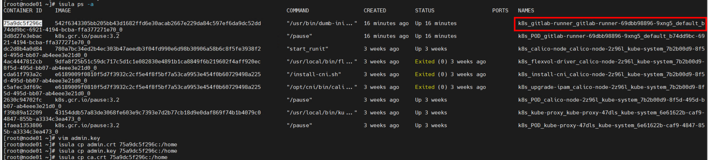

## 注册gitlab-runner

进入到runner的容器内进行注册；目前采用交互式注册，注册信息在gitlab上获得，当前配置的 runner服务于项目组，此信息的界面在gitlab-\>项目组（group）-\>设置-\>CI/CD-\>runner中查看。

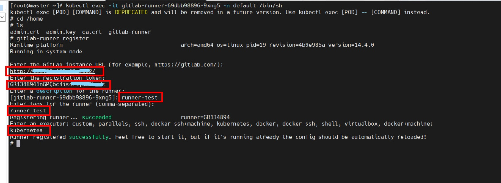

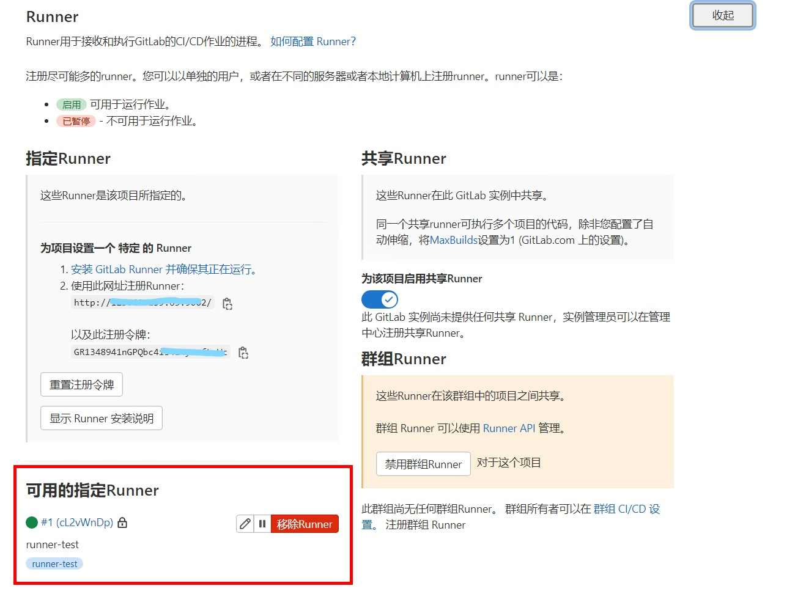

将准备好的gitlab-runner-helper镜像提前上传至私有镜像仓，进入gitlab-runner容器中，修改配置文件。

```bash
# cd /etc/gitlab-runner
# mkdir kubessl
# cp /home/admin.crt /etc/gitlab-runner/kubessl
# cp /home/ca.crt /etc/gitlab-runner/kubessl
# cp /home/admin.key /etc/gitlab-runner/kubessl
# vim /etc/gitlab-runner/config.toml
```

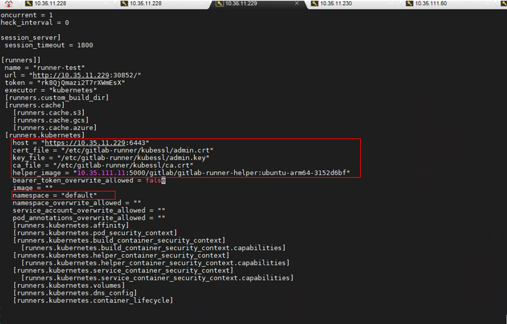

## 在manager节点进行如下操作添加gitlab容器的dns记录

1. 查看gitlab容器的ip地址。

   ```bash
   # kubectl get pods –Aowide
   ```

2. 添加gitlabip地址到k8s dns配置文件。

   ```bash
   # kubectl edit configmaps coredns -n kube-system
   ```

   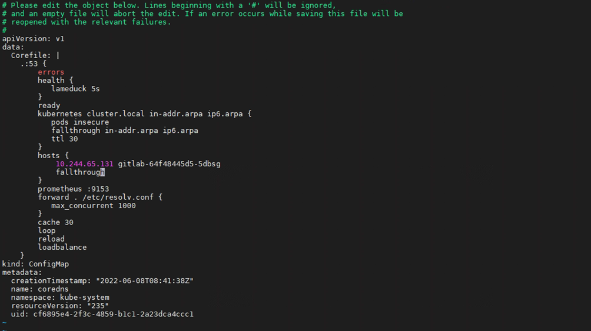

3. 重启coredns服务。

   ```bash
   # kubectl scale deployment coredns -n kube-system --replicas=0
   # kubectl scale deployment coredns -n kube-system --replicas=2
   ```

## gitlab运行测试

返回gitlab的web界面，选择CI/CD--编辑器--创建CI/CD流水线。

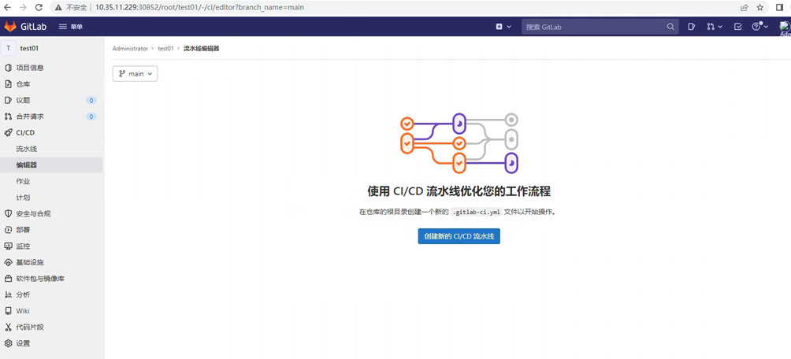

- 编译yaml文件如下：

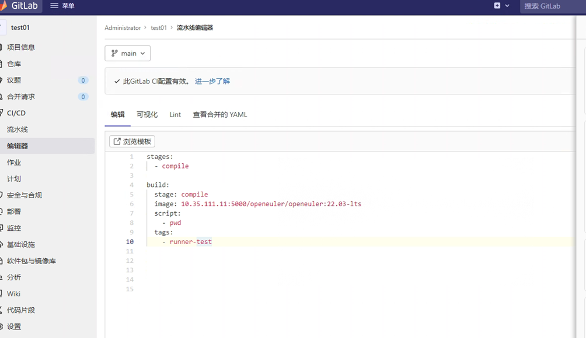

- 流水线-查看状态。

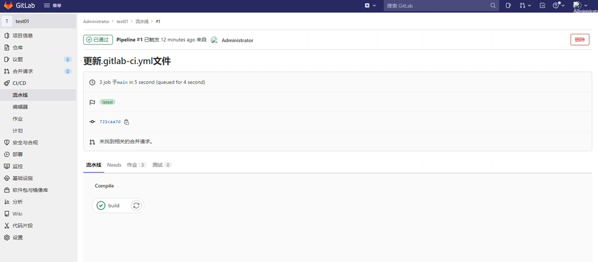
