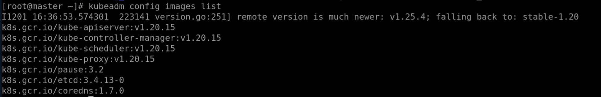

# iSulad+k8s环境部署

## 准备集群服务器

需准备至少3台openEuler机器，建议在openEuler-22.03及以上版本运行。下表为示例搭建机器信息，仅供参考。

| 主机名 | IP          | 系统版本                | 角色      | 组件       |
|-------|-------------|------------------------|----------|-----------|
| lab1  | 197.xxx.xxx.xxx | openEuler 22.03 LTS SP4 | 控制节点  | iSulad/k8s |
| lab2  | 197.xxx.xxx.xxx | openEuler 22.03 LTS SP4 | 工作节点1 | iSulad/k8s |
| lab3  | 197.xxx.xxx.xxx | openEuler 22.03 LTS SP4 | 工作节点2 | iSulad/k8s |

## 镜像/软件信息

安装过程中需要用到的软件及镜像名称如下表，版本号为示例安装时用到的版本，仅供参考。

| 软件                               | 版本     |
|------------------------------------|----------|
| iSulad                             | 2.0.17-2 |
| kubernetes-client                  | 1.20.2-9 |
| kubernetes-kubeadm                 | 1.20.2-9 |
| kubernetes-kubelet                 | 1.20.2-9 |

| 镜像                               | 版本     |
|------------------------------------|----------|
| k8s.gcr.io/kube-proxy              | v1.20.2  |
| k8s.gcr.io/kube-apiserver          | v1.20.2  |
| k8s.gcr.io/kube-controller-manager | v1.20.2  |
| k8s.gcr.io/kube-scheduler          | v1.20.2  |
| k8s.gcr.io/etcd                    | 3.4.13-0 |
| k8s.gcr.io/coredns                 | 1.7.0    |
| k8s.gcr.io/pause                   | 3.2      |
| calico/node                        | v3.14.2  |
| calico/pod2daemon-flexvol          | v3.14.2  |
| calico/cni                         | v3.14.2  |
| calico/kube-controllers            | v3.14.2  |

如果在无外网环境中搭建，可以从以下链接提前下载对应版本的软件包、相关依赖软件包及镜像：

1. 软件包下载地址：<https://dl-cdn.openeuler.openatom.cn>
2. 镜像下载地址：[https://developer.aliyun.com/mirror/](https://developer.aliyun.com/mirror/)

## 修改host文件

1. 修改主机名，以其中一台机器为例。

   ```shell
   # hostnamectl set-hostname lab1
   # sudo -i
   ```

2. 配置主机名解析，编辑三台服务器的/etc/hosts文件。

   ```shell
   # vim /etc/hosts
   ```

3. 在hosts文件中添加以下内容（IP+主机名）。

   ```text
   197.xxx.xxx.xxx lab1
   197.xxx.xxx.xxx lab2
   197.xxx.xxx.xxx lab3
   ```

## 环境准备

1. 关闭防火墙。

   ```shell
   # systemctl stop firewalld
   # systemctl disable firewalld
   ```

2. 禁用selinux。

   ```shell
   # setenforce 0
   ```

3. 关闭系统swap。

   ```shell
   # swapoff -a
   # sed -ri 's/.*swap.*/#&/' /etc/fstab
   ```

4. 网络配置，开启相应的转发机制。

   ```shell
   # cat > /etc/sysctl.d/kubernetes.conf <<EOF
   net.bridge.bridge-nf-call-iptables = 1
   net.ipv4.ip_forward = 1
   net.bridge.bridge-nf-call-ip6tables = 1
   vm.swappiness=0
   EOF
   ```

5. 生效规则。

   ```shell
   # modprobe overlay
   # modprobe br_netfilter
   # sysctl -p /etc/sysctl.d/kubernetes.conf
   ```

6. 配置开机启动脚本。

   ```shell
   # vim /etc/init.d/k8s.sh
   ```

   - 在k8s.sh脚本中添加以下内容。

     ```shell
     #!/bin/sh
     modprobe br_netfilter
     sysctl -w net.bridge.bridge-nf-call-ip6tables = 1
     sysctl -w net.bridge.bridge-nf-call-iptables = 1
     ```

   - 改变脚本权限。

     ```shell
     # chmod +x /etc/init.d/k8s.sh
     ```

7. 添加配置文件。
   
   配置文件br_netfilte.service应该放在systemd的service目录，一般在/usr/lib/systemd/system。

   ```shell
   # vim br_netfilte.service
   
   [Unit]
   Description=To enable the core module br_netfilter when reboot
   After=default.target
   [Service]
   ExecStart=/etc/init.d/k8s.sh //可以自定义
   [Install]
   WantedBy=default.target
   ```

   - 添加完成后启动服务。

     ```shell
     # systemctl daemon-reload
     # systemctl enable br_netfilter.service
     ```

8. 配置sysctl。

   ```shell
   # sed -i "s/net.ipv4.ip_forward=0/net.ipv4.ip_forward=1/g" /etc/sysctl.conf
   # sed -i 12a\vm.swappiness=0 /etc/sysctl.conf
   ```

## 安装kubeadm、kubectl、kubelet组件及iSulad

1. 使用yum install安装软件包。

   kubernetes相关的组件在EPOL中，使用yum安装前需要在yum源中配置EPOL源。

   ```shell
   # yum install -y kubernetes-kubeadm
   # yum install -y kubernetes-client
   # yum install -y kubernetes-kubelet
   # yum install -y iSulad
   ```

2. 设置kubelet开机启动。

   ```shell
   # systemctl enable kubelet
   ```

## 修改isulad配置

1. 进入/etc/isulad，修改daemon.json文件。

   ```shell
   # vi /etc/isulad/daemon.json
   ```

2. 修改并添加配置文件中的内容。

   ```json
   {
      "group": "isula",
      "default-runtime": "runc",
      "graph": "/var/lib/isulad",
      "state": "/var/run/isulad",
      "engine": "lcr",
      "log-level": "ERROR",
      "pidfile": "/var/run/isulad.pid",
      "log-opts": {
         "log-file-mode": "0600",
         "log-path": "/var/lib/isulad",
         "max-file": "1",
         "max-size": "30KB"
      },
      "log-driver": "stdout",
      "container-log": {
         "driver": "json-file"
      },
      "hook-spec": "/etc/default/isulad/hooks/default.json",
      "start-timeout": "2m",
      "storage-driver": "overlay2",
      "storage-opts": [
         "overlay2.override_kernel_check=true"
      ],
      "registry-mirrors": [
                  "docker.io"
      ],
      "insecure-registries": [
                  "k8s.gcr.io",
                  "quay.io",
                  "oci.inhuawei.com",
                  "rnd-dockerhub.huawei.com",
                  "registry.aliyuncs.com",
                  "【本地私有镜像仓IP】"
      ],
      "pod-sandbox-image": "k8s.gcr.io/pause:3.2",
      "native.umask": "normal",
      "network-plugin": "cni",
      "cni-bin-dir": "/opt/cni/bin",
      "cni-conf-dir": "/etc/cni/net.d",
      "image-layer-check": false,
      "use-decrypted-key": true,
      "insecure-skip-verify-enforce": false,
      "cri-runtimes": {
         "kata": "io.containerd.kata.v2"
      }
   }
   ```

3. 重启isulad服务。

   ```shell
   # systemctl restart isulad
   ```

## 加载isulad镜像

1. 查看需要的系统镜像。

   ```shell
   # kubeadm config images list
   ```

   注意对应的版本号，输出结果如图所示。
   

2. 使用isula拉取所需镜像。

   > [!NOTE]说明
   >
   > 以下所下载的镜像版本均为示例，具体版本号以上条命令返回结果为准，下同。

   ```shell
   # isula pull k8smx/kube-apiserver:v1.20.15
   # isula pull k8smx/kube-controller-manager:v1.20.15
   # isula pull k8smx/kube-scheduler:v1.20.15
   # isula pull k8smx/kube-proxy:v1.20.15
   # isula pull k8smx/pause:3.2
   # isula pull k8smx/coredns:1.7.0
   # isula pull k8smx/etcd:3.4.13-0
   ```

3. 修改已下载的镜像标签。

   ```shell
   # isula tag k8smx/kube-apiserver:v1.20.15 k8s.gcr.io/kube-apiserver:v1.20.15
   # isula tag k8smx/kube-controller-manager:v1.20.15 k8s.gcr.io/kube-controller-manager:v1.20.15
   # isula tag k8smx/kube-scheduler:v1.20.15 k8s.gcr.io/kube-scheduler:v1.20.15
   # isula tag k8smx/kube-proxy:v1.20.15 k8s.gcr.io/kube-proxy:v1.20.15
   # isula tag k8smx/pause:3.2 k8s.gcr.io/pause:3.2
   # isula tag k8smx/coredns:1.7.0 k8s.gcr.io/coredns:1.7.0
   # isula tag k8smx/etcd:3.4.13-0 k8s.gcr.io/etcd:3.4.13-0
   ```

4. 删除旧镜像。

   ```shell
   # isula rmi k8smx/kube-apiserver:v1.20.15
   # isula rmi k8smx/kube-controller-manager:v1.20.15
   # isula rmi k8smx/kube-scheduler:v1.20.15
   # isula rmi k8smx/kube-proxy:v1.20.15
   # isula rmi k8smx/pause:3.2
   # isula rmi k8smx/coredns:1.7.0
   # isula rmi k8smx/etcd:3.4.13-0
   ```

5. 查看已拉取的镜像。

   ```shell
   # isula images
   ```

## 安装crictl工具

```shell
# yum install -y cri-tools
```

## 初始化master节点

执行如下命令初始化master节点：

```shell
# kubeadm init --kubernetes-version v1.20.2 --cri-socket=/var/run/isulad.sock --pod-network-cidr=[指定pod分配IP段]

//以上参数的解释
kubernetes-version 为当前安装的版本
cri-socket 指定引擎为isulad
pod-network-cidr 指定pod分配的ip段
```

根据系统提示输入如下命令：

```shell
# mkdir -p $HOME/.kube
# sudo cp -i /etc/kubernetes/admin.conf $HOME/.kube/config
# sudo chown $(id -u):$(id -g) $HOME/.kube/config
```

初始化成功后，复制最后两行内容，在node节点上执行刚刚复制的命令，将节点加入master集群，如未记录上述命令可通过如下命令生成：

```shell
# kubeadm token create --print-join-command
```

## node节点添加进集群

粘贴master上初始化生成的kubeadm join ...命令，并在discovery前添加--cri-socket=/var/run/isulad.sock，执行如下命令：

```shell
# kubeadm join [IP地址] --token bgyis4.euwkjqb7jwuenwvs --cri-socket=/var/run/isulad.sock --discovery-token-ca-cert-hash sha256:3792f02e136042e2091b245ac71c1b9cdcb97990311f9300e91e1c339e1dfcf6
```

## 安装calico网络插件

1. 拉取calico镜像。

   需要在master节点配置calico网络插件，同时需要在每个节点中提前拉取需要版本的镜像。

   ```shell
   isula pull calico/node:v3.14.2
   isula pull calico/cni:v3.14.2
   isula pull calico/kube-controllers:v3.14.2
   isula pull calico/pod2daemon-flexvol:v3.14.2
   ```

2. 在master节点上获取配置文件。

   ```shell
   wget https://docs.projectcalico.org/v3.14/manifests/calico.yaml
   ```

3. 修改后创建pod。

   ```shell
   # kubectl apply -f calico.yaml
   ```

   - 如需删除使用如下命令：

     ```shell
     # kubectl delete -f calico.yaml
     ```

4. 查看pod信息。

   ```shell
   # kubectl get pod -A -o wide
   ```

## 查看master节点node信息

使用如下命令可查看节点的详细信息：

```shell
# kubectl get nodes -o wide
```

若需要重置node节点，可使用如下命令：

```shell
# kubeadm reset
```
