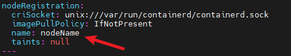
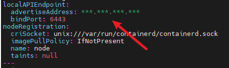
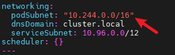
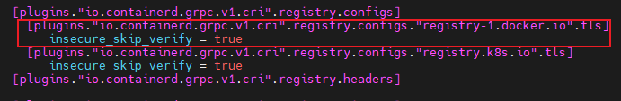

# Kubernetes集群部署指南 - containerd

Kubernetes自1.21版本开始不再支持Kubernetes+docker部署Kubernetes集群，本文介绍以containerd作为容器运行时快速搭建Kubernetes集群。若需要对集群进行个性化配置，请查阅[官方文档](https://kubernetes.io/zh-cn/docs/home/) 。

## 软件包安装

### 1. 安装必要软件包

```bash
$ yum install -y containerd
$ yum install -y kubernetes*
$ yum install -y cri-tools
```

> **说明**
>
> - 如果系统中已经安装了Docker，请确保在安装containerd之前卸载Docker，否则可能会引发冲突。

要求使用1.6.22-15或更高版本的containerd，如果下载的版本过低请运行以下命令升级成1.6.22-15版本，或自行升级。

```bash
$ wget --no-check-certificate https://dl-cdn.openeuler.openatom.cn/openEuler-24.03-LTS/update/x86_64/Packages/containerd-1.6.22-15.oe2403.x86_64.rpm
$ rpm -Uvh containerd-1.6.22-15.oe2403.x86_64.rpm
```

本教程中通过yum下载的软件包版本如下所示：

```bash
1. containerd
  -架构：x86_64
  -版本：1.6.22-15
2. kubernetes - client/help/kubeadm/kubelet/master/node
  -架构：x86_64
  -版本：1.29.1-4
3. cri-tools
  -架构：X86_64
  -版本：1.29.0-3
```

### 2. 下载cni组件

```bash
$ mkdir -p /opt/cni/bin
$ cd /opt/cni/bin
$ wget --no-check-certificate https://github.com/containernetworking/plugins/releases/download/v1.5.1/cni-plugins-linux-amd64-v1.5.1.tgz
$ tar -xzvf ./cni-plugins-linux-amd64-v1.5.1.tgz -C .
```

> **说明**
>
> - 这里提供的是AMD64架构版本的下载链接，请根据系统架构选择合适的版本，其他版本可从[github仓库](https://github.com/containernetworking/plugins/releases/)获取。

### 3. 下载CNI插件(Flannel)

```bash
$ wget https://raw.githubusercontent.com/flannel-io/flannel/master/Documentation/kube-flannel.yml --no-check-certificate
```

## 环境配置

本节对Kubernetes运行时所需的操作系统环境进行配置。

### 1. 设置主机名

```bash
$ hostnamectl set-hostname nodeName
```

### 2. 配置防火墙

**方法一：**

配置防火墙规则以开放etcd和API Server的端口，确保控制平面和工作节点之间的正常通信。
开放etcd的端口：

```bash
$ firewall-cmd --zone=public --add-port=2379/tcp --permanent
$ firewall-cmd --zone=public --add-port=2380/tcp --permanent
```

开放API Server的端口：

```bash
$ firewall-cmd --zone=public --add-port=6443/tcp --permanent
```

使防火墙规则生效：

```bash
$ firewall-cmd --reload
```

> **说明**
>
> - 防火墙配置可能会导致某些容器镜像无法正常使用。为了确保其顺利运行，需要根据所使用的镜像开放相应的端口。

**方法二：**

使用以下命令禁用防火墙：

```bash
$ systemctl stop firewalld
$ systemctl disable firewalld
```

### 3. 禁用SELinux

SELinux的安全策略可能会阻止容器内的某些操作，比如写入特定目录、访问网络资源、或执行具有特权的操作。这会导致 CoreDNS 等关键服务无法正常运行，并表现为CrashLoopBackOff或 Error状态。可以使用以下命令来禁用SELinux：

```bash
$ setenforce 0
$ sed -i "s/SELINUX=enforcing/SELINUX=disabled/g" /etc/selinux/config
```

### 4. 禁用swap

Kubernetes的资源调度器根据节点的可用内存和CPU资源来决定将哪些Pod分配到哪些节点上。如果节点上启用了swap，实际可用的物理内存和逻辑上可用的内存可能不一致，这会影响调度器的决策，导致某些节点出现过载，或者在某些情况下调度错误。因此需要禁用swap：

```bash
$ swapoff -a
$ sed -ri 's/.*swap.*/#&/' /etc/fstab
```

### 5. 网络配置

启用桥接网络上的IPv6和IPv4流量通过iptables进行过滤，并启动IP转发，运行内核转发IPv4包，确保跨界点的Pod间通信：

```bash
$ cat > /etc/sysctl.d/k8s.conf << EOF
net.bridge.bridge-nf-call-ip6tables = 1
net.bridge.bridge-nf-call-iptables = 1
net.ipv4.ip_forward = 1
vm.swappiness=0
EOF
$ modprobe br_netfilter
$ sysctl -p /etc/sysctl.d/k8s.conf
```

## 配置containerd

本节对containerd进行配置，包括设置pause_image、cgroup驱动、关闭"registry.k8s.io"镜像源证书验证、配置代理。

首先，生成containerd的默认配置文件并将其输出到containerd_conf指定的文件：

```bash
$ containerd_conf="/etc/containerd/config.toml"
$ mkdir -p /etc/containerd
$ containerd config default > "${containerd_conf}"
```

配置pause_image：

```bash
$ pause_img=$(kubeadm config images list | grep pause | tail -1)
$ sed -i "/sandbox_image/s#\".*\"#\"${pause_img}\"#" "${containerd_conf}" 
```

将cgroup驱动指定为systemd：

```bash
$ sed -i "/SystemdCgroup/s/=.*/= true/" "${containerd_conf}"
```

关闭"registry.k8s.io"镜像源证书验证：

```bash
$ sed -i '/plugins."io.containerd.grpc.v1.cri".registry.configs/a\[plugins."io.containerd.grpc.v1.cri".registry.configs."registry.k8s.io".tls]\n  insecure_skip_verify = true' /etc/containerd/config.toml
```

配置代理(将HTTP_PROXY、HTTPS_PROXY、NO_PROXY中的"***"替换为自己的代理信息)：

```bash
$ server_path="/etc/systemd/system/containerd.service.d"
$ mkdir -p "${server_path}"
$ cat > "${server_path}"/http-proxy.conf << EOF
[Service]
Environment="HTTP_PROXY=***"
Environment="HTTPS_PROXY=***"
Environment="NO_PROXY=***"
EOF
```

重启containerd，使得以上配置生效：

```bash
$ systemctl daemon-reload
$ systemctl restart containerd
```

## 配置crictl使用containerd作为容器运行时

```bash
$ crictl config runtime-endpoint unix:///run/containerd/containerd.sock
$ crictl config image-endpoint unix:///run/containerd/containerd.sock
```

## 配置kubelet使用systemd作为cgroup驱动

```bash
$ systemctl enable kubelet.service
$ echo 'KUBELET_EXTRA_ARGS="--runtime-cgroups=/systemd/system.slice --kubelet-cgroups=/systemd/system.slice"'  >> /etc/sysconfig/kubelet
$ systemctl restart kubelet
```

## 使用Kubeadm创建集群（仅控制平面需要）

### 1. 配置集群信息

```bash
$ kubeadm config print init-defaults --component-configs KubeletConfiguration >> kubeletConfig.yaml
$ vim kubeletConfig.yaml  
```

在kubeletConfig.yaml文件中，配置节点名称、广播地址（advertiseAddress）以及Pod网络的CIDR。

**修改name为主机名，与环境配置[第一步](#1-设置主机名)一致：**



**将advertiseAddress修改为控制平面的ip地址：**



**在Networking中添加podSubnet指定CIDR范围：**



### 2. 部署集群

这里使用kubeadm部署集群，许多配置是默认生成的（如认证证书），如需修改请查阅[官方文档](https://kubernetes.io/zh-cn/docs/home/ )。

**关闭代理（如有）：**

```bash
$ unset http_proxy https_proxy
```

使用kubeadm init部署集群：

```bash
$ kubeadm init --config  kubeletConfig.yaml
```

指定kubectl使用的配置文件：

```bash
$ mkdir -p "$HOME"/.kube
$ cp -i /etc/kubernetes/admin.conf "$HOME"/.kube/config
$ chown "$(id -u)":"$(id -g)" "$HOME"/.kube/config
$ export KUBECONFIG=/etc/kubernetes/admin.conf
```

### 3. 部署cni插件（flannel）

本教程中使用flannel作为cni插件，以下介绍flannel下载和部署。
以下使用的flannel从registry-1.docker.io镜像源下载，为避免证书验证失败的问题，请在containerd配置文件（/etc/containerd/config.toml）中配置该镜像源跳过证书验证。



使用kubectl apply部署最开始在软件包安装中下载的kube-flannel.yml。

```bash
$ kubectl apply -f kube-flannel.yml
```

> **说明**
>
> 控制平面可能会有污点的问题，导致kubectl get nodes中节点状态无法变成ready，请查阅[官方文档](https://kubernetes.io/zh-cn/docs/concepts/scheduling-eviction/taint-and-toleration/)去除污点。
>
## 加入集群（仅工作节点需要）

**关闭代理（如有）：**

```bash
$ unset http_proxy https_proxy
```

工作节点安装配置完环境后可以通过以下命令加入集群。

```bash
$ kubeadm join <br/>:</hash> --token <br/> --discovery-token-ca-cert-hash sha256:</hash>
```

这个命令会在控制平面库kubeadm init结束后生成，也可以在控制平面按照以下命令获取：

```bash
$ kubeadm token create  #生成token
$ openssl x509 -pubkey -in /etc/kubernetes/pki/ca.crt | openssl rsa -pubin -outform der 2>/dev/null | \
   openssl dgst -sha256 -hex | sed 's/^.* //'  #获取hash
```

加入后可以在控制平面通过以下命令查看工作节点的状态：

```bash
$ kubectl get nodes
```

如果节点状态显示为not ready，可能是因为Flannel插件未成功部署。在这种情况下，请运行本地生成的Flannel可执行文件来完成部署。

**在工作节点运行kubectl命令（可选）：**

如果需要在工作节点上运行kubectl命令，需要将控制面板的配置文件/etc/kubernetes/admin.conf复制到同样的目录，然后运行以下命令进行配置：

```bash
$ export KUBECONFIG=/etc/kubernetes/admin.conf
```
