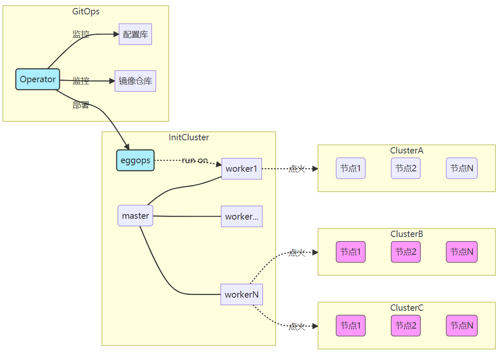

# 可拆分成的文档类型

解释（Explanations）

# 修改理由和意见

1. 原文档属于典型的解释类文档，符合Diátaxis对"解释"的定义：阐述概念、原理和背景信息
2. 结构不合理之处：缺少明确的层级划分，架构说明与工具介绍混合
3. 重构建议：将核心概念分层说明，保持原文技术细节不变，通过标题层级明确信息架构
4. 保留了所有技术细节描述和架构图引用，符合"不删减/扩展内容"的要求

# 改进后的结果

## 解释（Explanations）

# Kubernetes集群自动化部署原理
------------------------------------------------------------------------------------------------------------------------------------
1、 正确
## 工具背景
由于手动部署 Kubernetes 集群依赖人工部署各类组件，该方式耗时耗力。尤其是在大规模部署 Kubernetes 集群环境时，面临效率和出错的问题。为了解决该问题，openEuler 自 21.09 版本推出 Kubernetes 集群部署工具，该工具实现了大规模 Kubernetes 的自动化部署、部署流程追踪等功能，并且具备高度的灵活性。

## 系统架构

自动化集群部署整体架构如图所示，各模块含义如下：

- GitOps：负责集群配置信息的管理，如更新、创建、删除等；21.09 版本暂时不提供集群管理集群的功能。
- InitCluster：元集群，作为中心集群管理其他业务集群。
- eggops：自定义 CRD 和 controller 用于抽象 k8s 集群。
- master：k8s 的 master 节点，承载集群的控制面。
- worker：k8s 的负载节点，承载用户业务。
- ClusterA、ClusterB、ClusterC：业务集群，承载用户业务。
[工具源码地址](https://gitee.com/openeuler/eggo)
------------------------------------------------------------------------------------------------------------------------------------